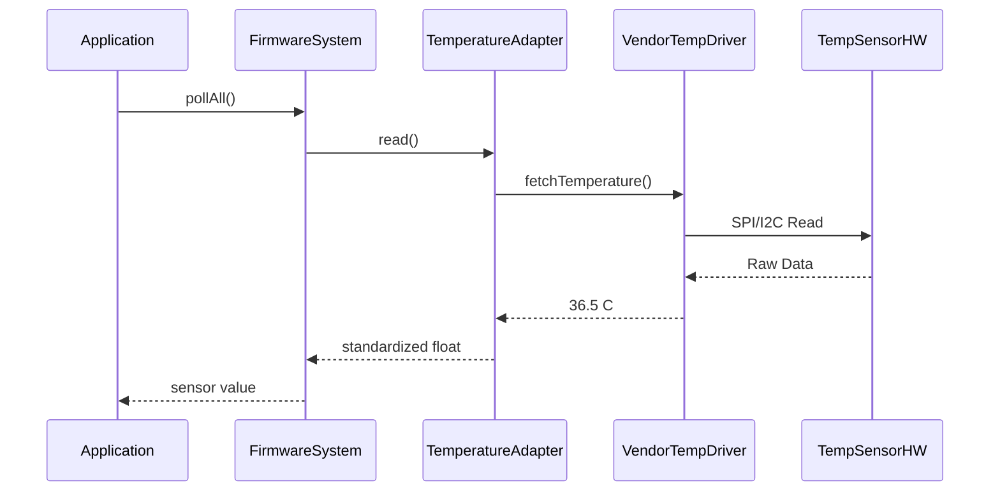

The Adapter Design Pattern is used when you already have existing modules/classes/interfaces, but their APIs are incompatible with what your system expects.

The Adapter pattern allows you to:

- Standardize interfaces
- Decouple application logic from hardware-specific drivers
- Improve portability
- Support multiple hardware vendors cleanly

---
#### Typical components:

| Role             | Responsibility                                             |
| ---------------- | ---------------------------------------------------------- |
| Target Interface | Defines the standard interface expected by the firmware    |
| Client           | Uses the target interface without knowing vendor specifics |
| Adapter          | Converts incompatible APIs into the target interface       |
| Adaptee          | Existing vendor/legacy class with incompatible API         |
| Concrete Adapter | Specific wrapper for a sensor/module                       |
| Firmware Manager | Coordinates all modules through a common interface         |
| Hardware Driver  | Low-level peripheral communication implementation          |
| Hardware Device  | Actual physical sensor/peripheral                          |

### Embedded Scenario

Suppose we are building a classic firmware that may have the following functionality:
- Temperature Sensor
- Pressure Sensor
- A PWM interface
- An ADC module
- battery Monitor
- Data logging module

---
This example demonstrates:
- How to implement the builder pattern
- How to follow SOLID principles while at it
- No dynamic polymorphism abuse
- Easy to extend

### Architecture:

#### Subjects:
Temperature Sensor
Pressure Sensor
Battery Monitor

#### Observers:
- PWM Controller
- Data Logger
- ADC Monitor

---
### Design:

