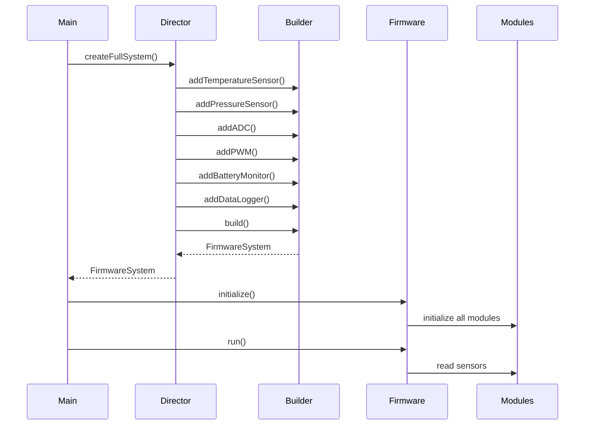

The Builder Pattern is a creational design pattern that simplifies the construction of complex objects by separating the construction process from the object's representation. This allows the same construction process to create different representations of an object. It is particularly useful when an object has many optional configurations or properties.

---
### Embedded Scenario

Suppose we are building a classic firmware that may have the following functionality:
- Temperature Sensor
- Pressure Sensor
- A PWM interface
- An ADC module
- battery Monitor
- Data logging module

---
This example demonstrates:
- How to implement the builder pattern
- How to follow SOLID principles while at it
- No dynamic polymorphism abuse
- Easy to extend

### Architecture:

We'll build a `FirmwareSystem` containing these modules.

Each module handles only its own functionality.
```
TemperatureSensor
PWMModule
ADCModule
```

Its easy to add new modules without modifying existing code.
```
class CANBusModule : public IPeripheral
```
### Typical components:

| Component             | What it is                                             |
| ---------------- | ---------------------------------------------------------- |
| Product | The complex object being constructed |
| Builder | An abstract interface defining the steps to build the product |
| Concrete builder | Implements the Builder interface to construct specific representations of the product |
| Director | Orachestartes the construction using a Builder |

---
### Design:

