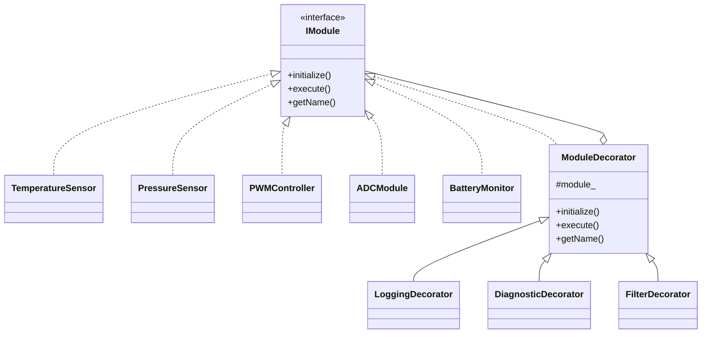

the Decorator Pattern is useful when you want to dynamically add behavior to a module without modifying the original class.

#### Fundamental of Factory Pattern:
Typical components:

| Role               | Responsibility                               |
| ------------------ | -------------------------------------------- |
| Component          | Common interface for all firmware modules    |
| Concrete Component | Actual sensor/module implementation          |
| Decorator          | Wraps another component and forwards calls   |
| Concrete Decorator | Adds extra functionality                     |
| Client             | Firmware application using decorated modules |

### Embedded Scenario

Suppose we are building a classic firmware that may have the following functionality:
- Temperature Sensor
- Pressure Sensor
- A PWM interface
- An ADC module
- battery Monitor
- Data logging module

---
This example demonstrates:
- How to implement the builder pattern
- How to follow SOLID principles while at it
- No dynamic polymorphism abuse
- Easy to extend

### Architecture:

| Decorator Pattern Role | Embedded Example                                                                      |
| ---------------------- | ------------------------------------------------------------------------------------- |
| Component              | `IModule`                                                                             |
| Concrete Component     | `TemperatureSensor`, `PressureSensor`, `PWMController`, `ADCModule`, `BatteryMonitor` |
| Decorator              | `ModuleDecorator`                                                                     |
| Concrete Decorators    | `LoggingDecorator`, `DiagnosticDecorator`, `FilterDecorator`                          |
| Client                 | `main()` firmware scheduler                                                           |

---
### Design:

