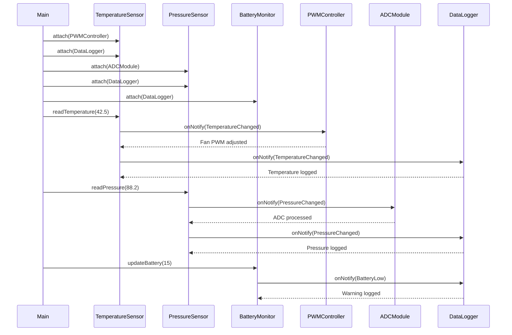

The Observer Pattern is a behavioral design pattern that establishes a one-to-many relationship between objects. A Subject maintains a list of Observers and notifies them automatically whenever its state changes.

#### Fundamental of Factory Pattern:
Typical components:

| Role              | Responsibility                       |
| ----------------- | ------------------------------------ |
| Subject           | Generates events/data                |
| Observer          | Interested in updates                |
| Concrete Subject  | Actual sensor/module                 |
| Concrete Observer | Logger, monitor, PWM controller, etc |

### Embedded Scenario

Suppose we are building a classic firmware that may have the following functionality:
- Temperature Sensor
- Pressure Sensor
- A PWM interface
- An ADC module
- battery Monitor
- Data logging module

---
This example demonstrates:
- How to implement the builder pattern
- How to follow SOLID principles while at it
- No dynamic polymorphism abuse
- Easy to extend

### Architecture:

#### Subjects:
- Temperature Sensor
- Pressure Sensor
- Battery Monitor

#### Observers:
- PWM Controller
- Data Logger
- ADC Monitor

---
### Design:

