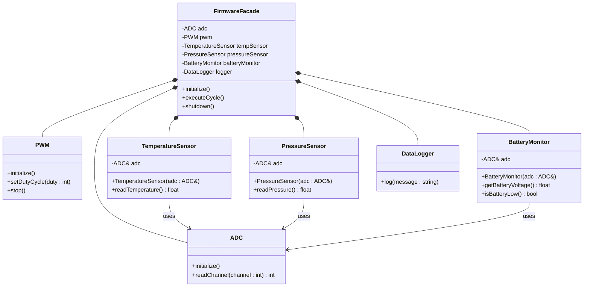

The Facade Design Pattern is a structural design pattern that provides a simple unified interface to a complex subsystem, instead of exposing many complicated classes directly to the client, a facade wraps them behind one easier interface.

## Core idea

Without Facade:
```
Client
  |
  +--> Class A
  +--> Class B
  +--> Class C
  +--> Class D
```
The client must:
- understand subsystem details
- call modules in correct order
- handle interactions manually

With Facade:
```
Client
   |
   v
Facade
   |
   +--> Class A
   +--> Class B
   +--> Class C
   +--> Class D
```
Client only talks to the facade. And the facade handles:
- coordination
- sequencing
- simplification
- delegation

## Typical Components

| Component              | Purpose                                       | Embedded Example                     |
| ---------------------- | --------------------------------------------- | ------------------------------------ |
| Facade                 | Provides simplified high-level interface      | `FirmwareFacade`                     |
| Subsystem Classes      | Actual functional modules                     | ADC, PWM, Sensors                    |
| Client                 | Uses the facade instead of subsystem directly | Main application                     |
| Coordination Logic     | Workflow/orchestration inside facade          | Sensor read → decision → PWM control |
| Initialization Manager | Handles startup order                         | ADC before sensor usage              |
| Error Handling Layer   | Centralized fault handling                    | Battery low detection                |
| Logging/Diagnostics    | Unified monitoring                            | DataLogger                           |
| Resource Manager       | Manages shared HW resources                   | Shared ADC                           |
| State Controller       | Controls firmware states                      | INIT/RUN/FAULT                       |

## Architecture:


