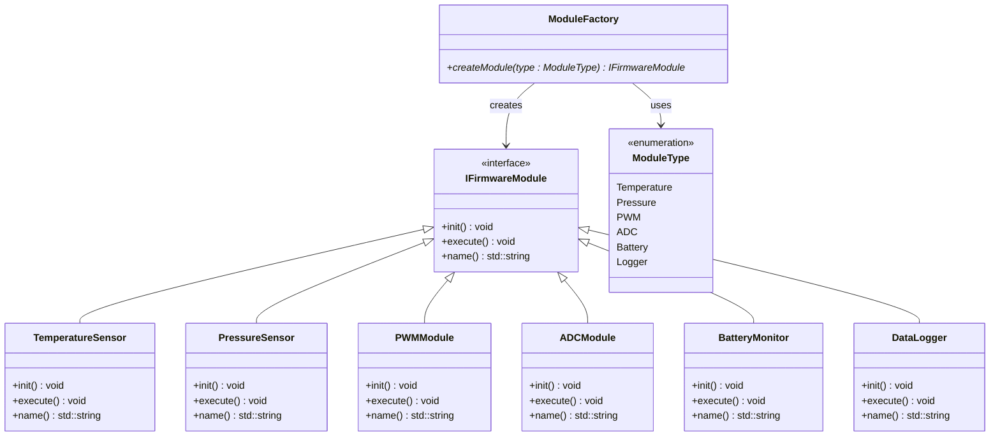
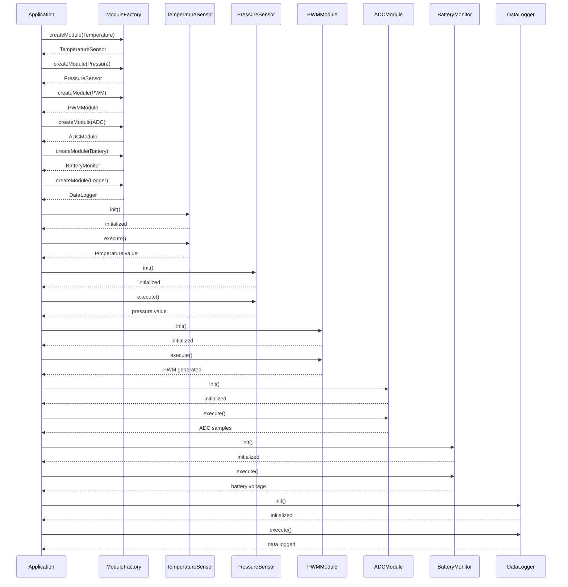

The Factory Pattern is a creational design pattern whose purpose is to create objects without exposing the exact creation logic to the irrelevant code.

Without the factory pattern the application becomes tightly coupled to every concrete implementation.

#### Fundamental of Factory Pattern:
Typical components:

| Component         | Responsibility         |
| ----------------- | ---------------------- |
| Product Interface | Common abstraction     |
| Concrete Products | Actual implementations |
| Factory           | Creates objects        |
| Client            | Uses objects           |

Core Idea of Factory pattern depends on the fact that, without Factory:

```
Application
   |
   +---- knows TemperatureSensor
   +---- knows PressureSensor
   +---- knows ADCModule
   +---- knows PWMModule
```
With Factory:
```
Application
    |
    +---- knows only IFirmwareModule
                    ^
                    |
              ModuleFactory
                    |
        --------------------------------
        |        |        |            |
      Temp     ADC      PWM       Pressure

```
The application only knows the interface and the factory. It does NOT know concrete implementations.

### Embedded Scenario

Suppose we are building a classic firmware that may have the following functionality:
- Temperature Sensor
- Pressure Sensor
- A PWM interface
- An ADC module
- battery Monitor
- Data logging module

---
This example demonstrates:
- How to implement the builder pattern
- How to follow SOLID principles while at it
- No dynamic polymorphism abuse
- Easy to extend

```
#### Class diagram:



### Architecture:

Instead of the application directly doing:

```
TemperatureSensor sensor;
```
or
```
new TemperatureSensor();
```
the application asks a Factory to create the object:
```
ModuleFactory::createModule(ModuleType::Temperature);

---
### Design:

