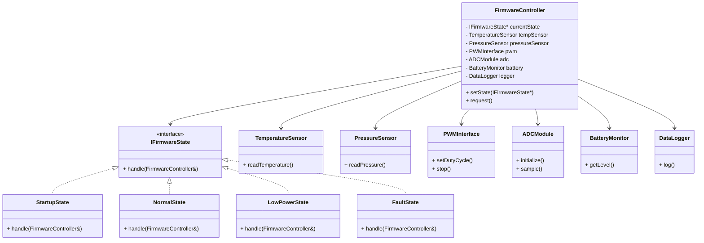

The State Design Pattern allows an object to change its behavior dynamically when its internal state changes.
Instead of using large switch-case or if-else blocks, each operational mode is represented as a separate state class.

In embedded firmware, this is especially useful for managing modes such as Startup, Normal Operation, Low Power, Fault, or Shutdown.

## Core Idea

The core idea of the State Pattern is:

> An object changes its behavior when its internal state changes.

Instead of writing one huge object containing many:

```
if (state == STARTUP) {
    ...
}
else if (state == IDLE) {
    ...
}
else if (state == FAULT) {
    ...
}
```
the behavior is split into separate state classes.

Each state becomes its own object responsible for:

- what actions are allowed
- how the system behaves
- when transitions occur

## Typical Components

| Component                  | Responsibility                                     |
| -------------------------- | -------------------------------------------------- |
| **Context**                | Main object whose behavior changes based on state  |
| **State Interface**        | Common interface for all concrete states           |
| **Concrete States**        | Individual operational modes implementing behavior |
| **State Transition Logic** | Determines when to switch states                   |
| **Client**                 | Uses the context object                            |


## Architecture

| Component              | Responsibility              | Example Here                                                 |
| ---------------------- | --------------------------- | ------------------------------------------------------------ |
| Context                | Maintains current state     | `FirmwareController`                                         |
| State Interface        | Common behavior interface   | `SystemState`                                                |
| Concrete States        | Specific behavior per state | `StartupState`, `NormalState`, `LowPowerState`, `FaultState` |
| State Transition Logic | Switches states dynamically | `changeState()`                                              |
| Client                 | Uses context                | `main()`                                                     |


